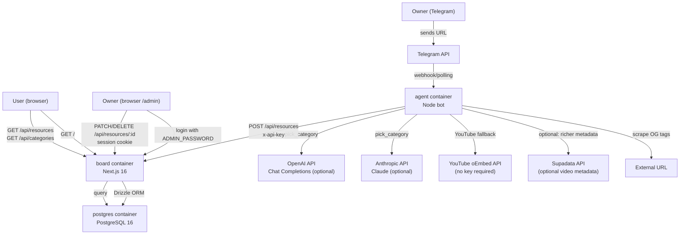

# ARCHITECTURE — Curator Board
*Last updated: 2026-06-05*

---

## 1. PROJECT STRUCTURE

```
curator-board/
├── app/                        # Next.js 16 App Router — pages and API routes
│   ├── api/
│   │   ├── categories/
│   │   │   └── route.ts        # GET + POST /api/categories
│   │   ├── admin/
│   │   │   ├── login/route.ts  # POST /api/admin/login
│   │   │   └── logout/route.ts # POST /api/admin/logout
│   │   └── resources/
│   │       ├── route.ts        # GET + POST /api/resources
│   │       └── [id]/
│   │           └── route.ts    # PATCH + DELETE /api/resources/:id
│   ├── admin/
│   │   ├── login/page.tsx      # Admin login page
│   │   └── page.tsx            # Session-protected admin editor
│   ├── globals.css             # Tailwind base styles
│   ├── layout.tsx              # Root HTML layout + metadata
│   └── page.tsx                # Public homepage (server component)
│
├── components/
│   ├── AdminDashboard.tsx      # Session-backed admin resource editor
│   ├── AdminLoginForm.tsx      # Admin login form
│   └── ResourceList.tsx        # Filterable resource list with share action
│
├── lib/
│   ├── admin-auth.ts           # Admin session and password helpers
│   ├── db.ts                   # Drizzle client singleton
│   ├── schema.ts               # Drizzle table definitions + inferred types
│   └── board-api-auth.ts       # x-api-key header check helper
│
├── db/
│   ├── migrate.ts              # CLI migration runner (tsx)
│   ├── seed.ts                 # Seeds the 12 default categories
│   └── migrations/
│       ├── 0000_concerned_doctor_strange.sql  # Initial schema
│       └── meta/               # Drizzle migration journal + snapshots
│
├── agent/                      # TypeScript Telegram bot runtime
│   ├── main.ts                 # Entry point — waits for board, starts polling
│   ├── bot.ts                  # Telegram handler registration + command logic
│   ├── parser.ts               # OG scraper + provider-agnostic category picker
│   ├── api-client.ts           # HTTP client for board REST API
│   ├── .env.example            # Env template for local bot runs
│   └── Dockerfile              # node:22-alpine container
│
├── docs/
│   ├── ARCHITECTURE.md         # This file
│   ├── PRD.md                  # Product requirements
│   ├── PLANNING.md             # Implementation phasing
│   ├── TASKS.md                # Active task tracker
│   ├── RUNBOOK.md              # Operational reference
│   └── adr/
│       ├── 0001-seeded-categories-with-llm-picker.md
│       ├── 0002-og-scrape-before-llm.md
│       └── 0003-public-read-api-key-write.md
│
├── .github/workflows/
│   ├── ci.yml                  # Lint + build on development branch / PRs
│
├── Dockerfile                  # Multi-stage Next.js production image
├── docker-compose.yml          # Local dev: Postgres only (port 5436)
├── docker-compose.prod.yml     # Production: postgres + board + agent
├── drizzle.config.ts           # Drizzle Kit config (schema path, migrations dir)
├── next.config.ts              # Next.js config — standalone output mode
├── package.json                # Node dependencies + pnpm scripts
├── pnpm-workspace.yaml         # pnpm workspace root
├── tsconfig.json               # TypeScript config
├── eslint.config.mjs           # ESLint (Next.js preset)
├── postcss.config.mjs          # PostCSS for Tailwind v4
├── .env.example                # Environment variable template
├── AGENTS.md                   # Instructions for AI assistants
└── README.md                   # Project overview and quick-start
```

---

## 2. HIGH-LEVEL SYSTEM DIAGRAM



**Request paths:**

| Path | Auth | Description |
|---|---|---|
| `GET /` | none | Public homepage — server-rendered resource list |
| `GET /api/resources` | none | Paginated resource list; filterable by category or search query |
| `GET /api/categories` | none | Full category list |
| `POST /api/admin/login` | none | Exchange `ADMIN_PASSWORD` for an admin session cookie |
| `POST /api/admin/logout` | session cookie | Clear the admin session cookie |
| `POST /api/resources` | `x-api-key` | Create or upsert a resource (used by agent) |
| `PATCH /api/resources/:id` | `x-api-key` or admin session | Update title, description, or category |
| `DELETE /api/resources/:id` | `x-api-key` or admin session | Remove a resource |
| `POST /api/categories` | `x-api-key` or admin session | Add a new category |
| `PATCH /api/categories/:id` | `x-api-key` or admin session | Update a category |
| `/admin/login` | none | Admin login screen |
| `/admin` | admin session | Owner editor for titles and categories |

---

## 3. CORE COMPONENTS

### 3.1 Board (Next.js app)

- **Purpose:** Serves the public curated link list, exposes the REST API, and provides the session-protected `/admin` editor.
- **Framework:** Next.js 16, App Router, React 19, TypeScript 5, Tailwind CSS v4
- **Entry points:**
  - `app/layout.tsx` — root HTML layout
  - `app/page.tsx` — public homepage (server component; fetches directly from DB)
  - `app/admin/login/page.tsx` — admin login page
  - `app/admin/page.tsx` — session-protected admin editor shell
  - `app/api/*/route.ts` — Next.js Route Handlers (API layer)
- **Deployment:** Docker container (`Dockerfile`), multi-stage build, `next build --output standalone`. Runs via `node server.js`. Port 3000.
- **Startup sequence:** `tsx db/migrate.ts && tsx db/seed.ts; node server.js` — migrations and seeding run automatically on every container start.

### 3.2 Agent (Telegram bot)

- **Purpose:** Accepts URLs from the owner via Telegram, enriches them with metadata, asks the configured AI provider to pick a category when available, then writes the resource to the board API.
- **Language/frameworks:** TypeScript, Node.js 22, `grammy`, native `fetch`, `cheerio`
- **Entry point:** `agent/main.ts` — waits for the board to respond (up to 30 attempts × 10 s), then starts long-polling Telegram.
- **Key modules:**
  - `bot.ts` — registers all Telegram command and message handlers
  - `parser.ts` — OG scraping pipeline + provider-agnostic category picker
  - `api-client.ts` — typed HTTP client for all board API calls
- **Deployment:** Docker container (`agent/Dockerfile`), `node:22-alpine`. Managed by `pnpm` + `tsx`.

### 3.3 Database access layer

- **Purpose:** Type-safe query interface shared by all API routes and the homepage server component.
- **Libraries:** Drizzle ORM 0.43, `postgres` 3.4 (PostgreSQL wire driver)
- **Key files:**
  - `lib/schema.ts` — table definitions and inferred TypeScript types
  - `lib/db.ts` — singleton Drizzle client
  - `lib/board-api-auth.ts` — shared `x-api-key` guard
  - `drizzle.config.ts` — Drizzle Kit config (schema path, migration output directory)

---

## 4. DATA STORES

### PostgreSQL 16

- **Purpose:** Single source of truth for all curated resources and their categories.
- **Local dev:** Runs in Docker on port 5436 (isolated from other projects on the same machine that use 5432–5435).
- **Production:** Managed as a Docker Compose service (`postgres`) with a named volume for persistence.

#### Table: `categories`

| Column | Type | Notes |
|---|---|---|
| `id` | serial PK | |
| `name` | text UNIQUE NOT NULL | Human-readable label, e.g. "AI & ML" |
| `slug` | text UNIQUE NOT NULL | URL-safe key, e.g. "ai-ml" |
| `seeded` | boolean DEFAULT true | `true` = part of the default taxonomy; `false` = added by owner post-deploy |
| `created_at` | timestamptz DEFAULT now() | |

#### Table: `resources`

| Column | Type | Notes |
|---|---|---|
| `id` | serial PK | |
| `url` | text UNIQUE NOT NULL | Source URL; upsert target |
| `title` | text NOT NULL | From OG scraper or Supadata |
| `description` | text | Optional; from OG or Supadata; truncated to 1000 chars |
| `category_id` | integer FK → categories.id | Many-to-one |
| `created_at` | timestamptz DEFAULT now() | |

**Default taxonomy (seeded):** AI & ML, Technology, Africa, Geopolitics & Politics, Business & Finance, Science, Philosophy & Culture, Japan, Design & UX, Tools & Products, Books & Writing, Other.

---

## 5. EXTERNAL INTEGRATIONS

| Service | Purpose | Integration |
|---|---|---|
| **Telegram Bot API** | Receives URL submissions from the owner; delivers bot replies | `grammy`, long-polling |
| **Anthropic API (Claude)** | Optional category picker for submitted resources | REST POST to `/v1/messages`; selected automatically when `ANTHROPIC_API_KEY` exists, or explicitly via `AI_PROVIDER=anthropic` |
| **OpenAI API** | Optional category picker for submitted resources | REST POST to `/v1/chat/completions`; selected automatically when `OPENAI_API_KEY` exists and Anthropic is absent, or explicitly via `AI_PROVIDER=openai` |
| **Supadata API** | Enriches video/social URLs (YouTube, TikTok, Instagram, Twitter/X) with real titles and descriptions | REST GET `https://api.supadata.ai/v1/metadata`; optional — skipped if `SUPADATA_API_KEY` is unset |
| **YouTube oEmbed** | Fallback title + channel name for YouTube URLs when Supadata is unavailable | Unauthenticated REST GET; no API key required |

**Metadata resolution order for social/video URLs:**
1. Supadata (if key present)
2. YouTube oEmbed (YouTube only, no key)
3. Standard OG tag scrape
4. Domain name as title (final fallback)

---

## 6. DEPLOYMENT & INFRASTRUCTURE

### Production environment

- **Platform:** Self-hosted Docker Compose
- **Compose file:** `docker-compose.prod.yml`

#### Production services

| Service | Image | Port | Purpose |
|---|---|---|---|
| `postgres` | `postgres:16-alpine` | internal only | Persistent database; health-checked before dependents start |
| `board` | built from `Dockerfile` | 3000 (internal) | Next.js app + API; `HOSTNAME=0.0.0.0` allows container-wide binding |
| `agent` | built from `agent/Dockerfile` | none | Telegram bot; connects to board via `http://board:3000` |

### Next.js Docker build (multi-stage)

| Stage | Base | Purpose |
|---|---|---|
| `deps` | `node:22-alpine` | Installs Node dependencies (frozen lockfile) |
| `builder` | `node:22-alpine` | Runs `pnpm build` with standalone output |
| `runner` | `node:22-alpine` | Minimal production image; includes `tsx`, migration files, and Drizzle packages needed at runtime |

### CI pipeline

**CI (`ci.yml`)** — triggers on push to `development` or PR to `development`/`main`:
1. Lint (`pnpm lint`)
2. Next.js build (with dummy DB URL and API secret)
3. Type check (`pnpm exec tsc --noEmit`)

### Branch strategy

- `development` — default working branch; CI runs here
- `main` — protected release branch; triggers production deploy

### Local development

- Only `docker-compose.yml` is used locally (Postgres on port 5436 only)
- Next.js runs via `pnpm dev`; agent runs via `pnpm agent:start`

---

## 7. SECURITY CONSIDERATIONS

### Authentication model (ADR-0003)

- **Public read:** All `GET` endpoints are unauthenticated. The curated list and categories are publicly accessible by design.
- **Machine write auth:** The Telegram bot uses `x-api-key: <BOARD_API_SECRET>` for write access to board API endpoints.
- **Admin page auth (current):** `/admin/login` accepts `ADMIN_PASSWORD`, sets a signed session cookie, and `/admin` plus admin-backed mutations trust that session rather than exposing `BOARD_API_SECRET` in the browser.
- **Telegram access control:** The agent checks `TELEGRAM_OWNER_ID` before executing write operations. Only messages from the configured owner ID can add or delete resources.

### Authorization helper

`lib/board-api-auth.ts` — single `hasBoardApiKey(req)` function; called at the top of every mutating route handler before any business logic.

### Transport security

- Production TLS depends on the operator's reverse proxy or hosting setup.
- Internal Docker network communication (agent → board, board → postgres) is unencrypted but contained within the Docker bridge network.

### Known security gaps (tracked in roadmap)

- Machine auth and human admin auth remain separate by design: `BOARD_API_SECRET` for bot/server writes, `ADMIN_PASSWORD` + session cookie for the browser admin flow.

---

## 8. DEVELOPMENT & TESTING

### Prerequisites

| Tool | Version | Purpose |
|---|---|---|
| Node.js | 22+ | Next.js runtime and build |
| pnpm | latest | Node package manager |
| Docker | any recent | Local PostgreSQL |

### Local setup

```bash
# 1. Start PostgreSQL (port 5436)
docker compose up -d

# 2. Configure environment
cp .env.example .env.local
# Set BOARD_API_SECRET=$(openssl rand -hex 32) in .env.local

# 3. Install Node dependencies
pnpm install --ignore-scripts

# 4. Run migrations and seed categories
pnpm db:migrate
pnpm db:seed

# 5. Start the Next.js dev server
pnpm dev
# → http://localhost:3000

# 6. (Optional) Start the Telegram agent in a second terminal
cp agent/.env.example agent/.env
# Set TELEGRAM_BOT_TOKEN, TELEGRAM_OWNER_ID, BOARD_API_SECRET, and any optional AI keys
pnpm agent:start
```

### Key commands

```bash
# Board
pnpm dev           # Hot-reload dev server
pnpm build         # Production build
pnpm lint          # ESLint
pnpm db:migrate    # Apply pending migrations
pnpm db:seed       # Seed/refresh default categories (idempotent)
pnpm db:generate   # Generate migration file after schema changes
pnpm db:studio     # Drizzle Studio at http://localhost:4983

# Agent
pnpm agent:start
```

### Testing

There is no automated test suite currently. CI verifies correctness via:
- `pnpm lint` (ESLint, Next.js preset)
- `pnpm build` (TypeScript compilation + Next.js build)
- `pnpm exec tsc --noEmit` (web and agent type checks)

End-to-end verification is done manually by sending a URL to the Telegram bot and checking that it appears on the board.

### Code quality tools

| Tool | Config file | Scope |
|---|---|---|
| ESLint 9 | `eslint.config.mjs` | TypeScript + Next.js rules |
| TypeScript 5 | `tsconfig.json` | Strict mode |
| Tailwind CSS v4 | `postcss.config.mjs` | Utility-first CSS via PostCSS |

---

## 9. FUTURE CONSIDERATIONS

### Active roadmap (from `docs/TASKS.md`)

**Open-source cleanup**
- Keep the repository public-ready and remove internal-only material
- Keep contributor guidance and setup docs current

**Ingestion and auth**
- Preserve no-provider fallback to `other`
- Keep provider-agnostic categorization
- Ensure optional enrichment failures never block resource creation

**Runtime**
- TypeScript/Node Telegram bot is the primary ingestion runtime

### Known technical debt

- No automated test suite — all verification is lint + build + manual.

---

## 10. GLOSSARY

| Term | Definition |
|---|---|
| **Board** | The Next.js web application (public site + API). Named for the "curator board" concept. |
| **Agent** | The TypeScript/Node.js Telegram bot that accepts URLs, enriches them, and writes to the Board API. |
| **Resource** | A single saved link: URL + title + optional description + category. |
| **Category** | A controlled-vocabulary label (e.g. "AI & ML", "Africa") that classifies resources. |
| **Seeded category** | A category inserted by `db/seed.ts` at deploy time. `seeded = true` in the DB. |
| **Slug** | URL-safe ASCII identifier for a category (e.g. `ai-ml`, `geopolitics`). |
| **BOARD_API_SECRET** | Shared 64-char hex secret that authorizes machine write operations via `x-api-key` header. Machine-to-machine auth only. |
| **ADMIN_PASSWORD** | Human admin password for session-based browser login. Separate from `BOARD_API_SECRET`. |
| **OG scrape** | Fetching Open Graph meta tags (`og:title`, `og:description`) from a URL using `fetch` + `cheerio`. |
| **Supadata** | Third-party API (`supadata.ai`) that provides richer metadata for YouTube and social URLs. Optional. |
| **Standalone output** | Next.js build mode (`output: "standalone"`) that produces a minimal `server.js` runnable without the full `node_modules` tree. |
| **Drizzle** | TypeScript ORM used for schema definition, query building, and migration management. |

---

## 11. PROJECT IDENTIFICATION

| Field | Value |
|---|---|
| **Project name** | Curator Board |
| **Repository** | `git@github.com:adusingi/curator-board.git` |
| **Primary contact** | adusingi (git user) |
| **Last updated** | 2026-06-05 |
